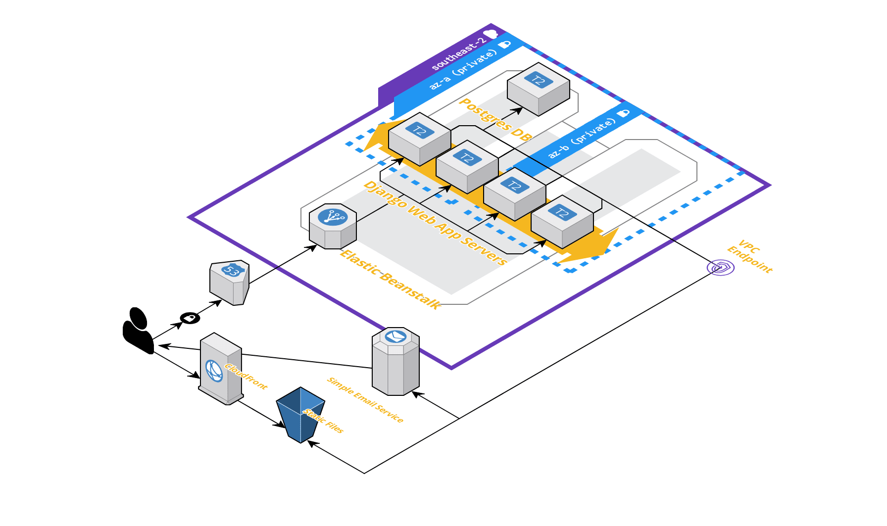

# Secret Santa

This application is a micro-game designed purely around creating the social interaction of Secret Santa, but in a virtualized, online environment. All users involved in an event can send an receive an emoji gift under the guise of random mystery. What fun!

## How it Works
1. Once a user is registered, they can create an event. Invites are sent by specifying an email.
2. If a user isn't registered, they'll be invited via the specified email to join up. Once registered they'll be automatically be added to the event. There's no opting out once you've joined Secret Santa, once you're in, you're in!
3. When the creator of an event is happy that everyone has joined, they can set a time for the big reveal. The gift givers and recipients are all determined and people can start giving.
4. Now the fun begins! Users will be notified that they have some gifting to do, and can choose their emoji and personalized message of choice.
5. When the big reveal happense users can log in and open their present, if their gift givers went MIA they'll receive coal instead :(
6. Grinches are pubically shamed, as they should be.

## Who is This Application For?

Anyone who's after a bit of fun! This game is probably best played amongst friends, but there's nothing that precludes strangers from playing as well. It's also designed to be a fun exercise for companies that want to create a bit of social engagement amongst their peers. 

## Tech Stack

* Python + Django: Serves as the application layer for the program. Handles everything from processing web endpoint requests, and acts as the ORM between the application and data layers.

* AWS Elastic Beanstalk: Provisions the webservers containing the Django applicaton by automatically configuring an auto-scaling group of EC2 instances. 

* S3 / Cloudfront: Where all static images and emoji gift images are served. S3 physically stores the media, and Cloudfront provisions it through making images available through caching and duplication in locations close to the user.

* Amazon Simple Email Service: Responsible for handling email communications to users. This is of particular importance for inviting new users to join, as well as notifying them when they've been added to an event, or when it's present opening time.

* Postgres / RDS: The underlying implementation of the data layer is a Postgreql database, which is provisioned by Amazon RDS, a managed database service. 

* Celery: This library is used to handle asynchronous background tasks. Celery is primarily used to handle the dispatch of mail requests whilst not locking the thread handling the user request.

## Wireframes

These wireframes below outline the user experience of the application.

### Login Screen

This screen will appear if the user has not authenticated and attempts to view any page in the domain. The two options are to log in or sign up.

### Create Account

This screen takes the user through the process of registering for Secret Santa. This is the page that a user will be directed towards if they've been invited by email as well.

### Edit Profile

If the user wishes to change their profile picture or display name, they can do so via this page.

### Landing Page

This is the page that gets loaded once the user is successfully logged in. It serves as the main index of the site.

### My Events

Any events that the user has created or been invited to will appear here.

### Create New Event

This is where a user can create a new event by specifying a name, description and time. They can also specify participants via email. If the email is already associated with an account, the user will be automatically added to the event, otherwise they will be invited via email to join. The creator can edit the event as many times as they like, however once the event has been set, no further changes will be possible.

### View Event

This is where all users can view events, and what they will see will vary on the current state of the event, designated by the status window section. The status windows could resemble any one of the following:

.png)

#### Event Phases

* Pre-Confirmed: If the user did not create the event, they will simply be informed to check back another time.

* Pre-Confirmed (Owner): If the owner views this section during this phase, they will have the option to edit or confirm the event, the latter of which will move the event onto the next phase.

* Gifting Phase: Users will be given a link to another page where they can choose their gift for their recipient.

* Post-Gifting Phase: Users will be given a countdown timer for when the event is due to begin.

* Reveal Phase: Users will have a present icon that will reveal their emoji gift and message in an animation.

* Post-Reveal Phase: User can see the gifts that others have received, and who the grinches were.

### Gifting Page

This window, linked from the event view page, allows the user to select an emoji and write a personalized message to their recipient. This is a one shot window, once the user has selected their present there's no taking it back!

## Cloud Architecture

For this application I'm relying on AWS infrastructure. I'm employing Elastic Beanstalk to automatically provision EC2 instances. It will scale between 1-4 instances that are T2.Micros class machines. These machines will be running docker images.

These EC2 instances will be located in private subnets, so in order to access services outside of the VPC, a VPC Endpoint will be used. This will allow the application to update the S3 bucket which hold the static images hosted by the application, as well as trigger the Simple Email Service (SES) that notifies users of application events.

The data layer will be stored in a single T2.medium instance on one of the private subnets.

Route 53 will provide the alias to connect a custom hostname to the Elastic Beanstalk application.

The application therefore can be represented as follows:

