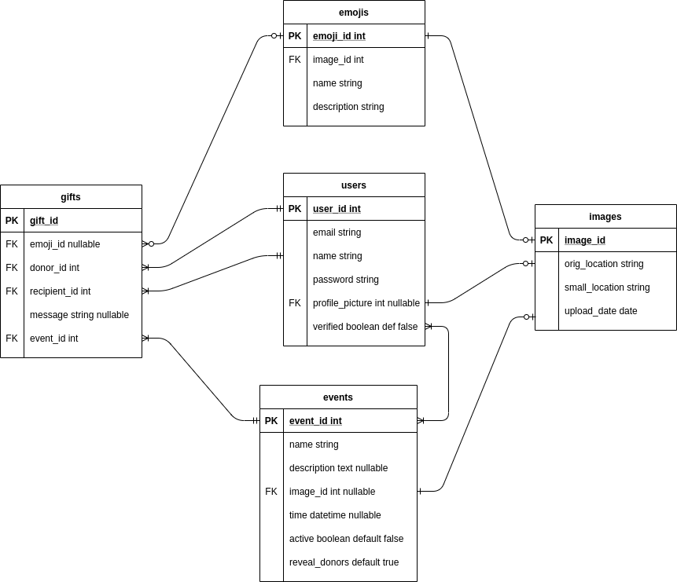
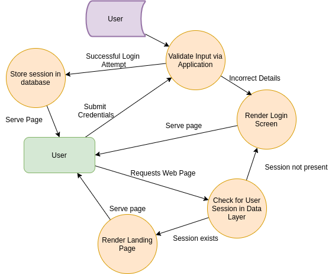
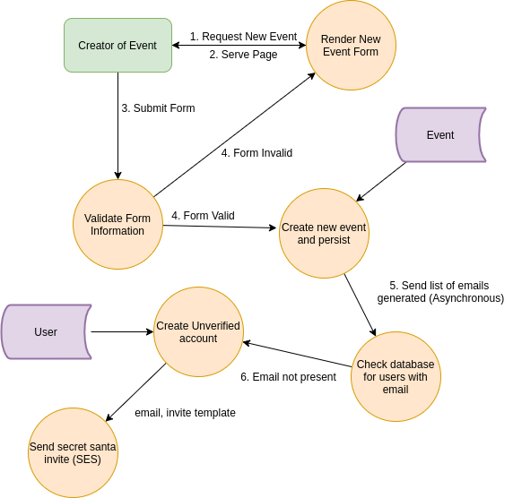
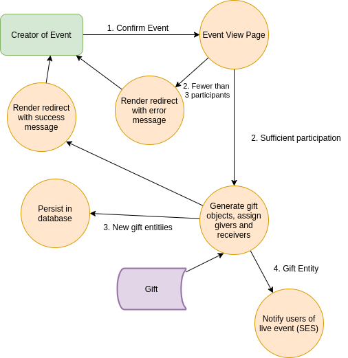
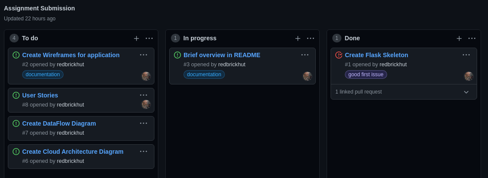
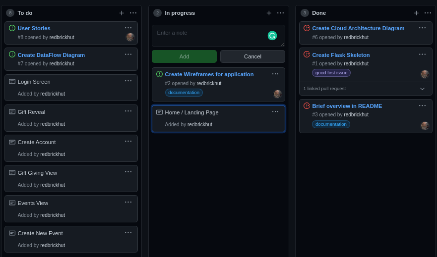
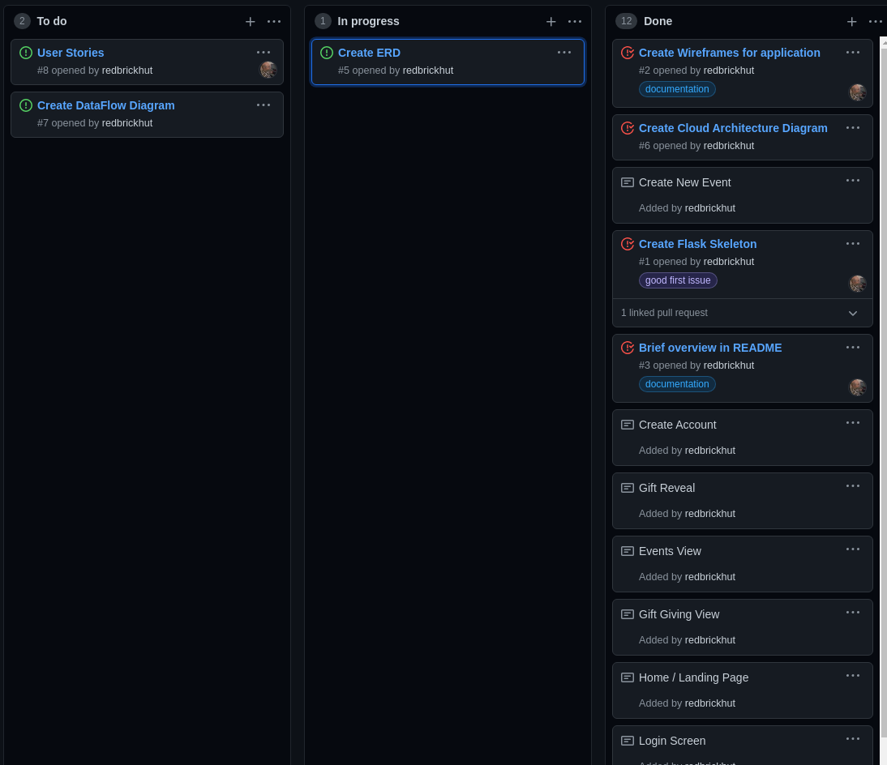
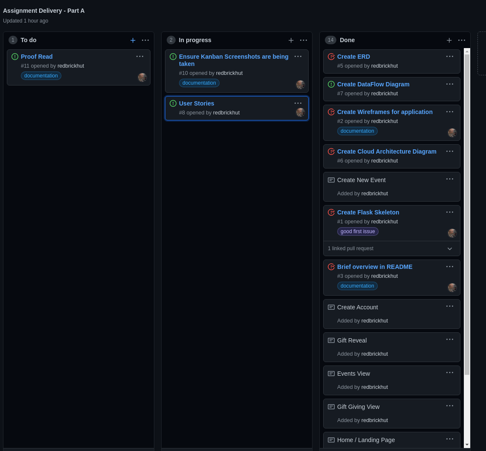
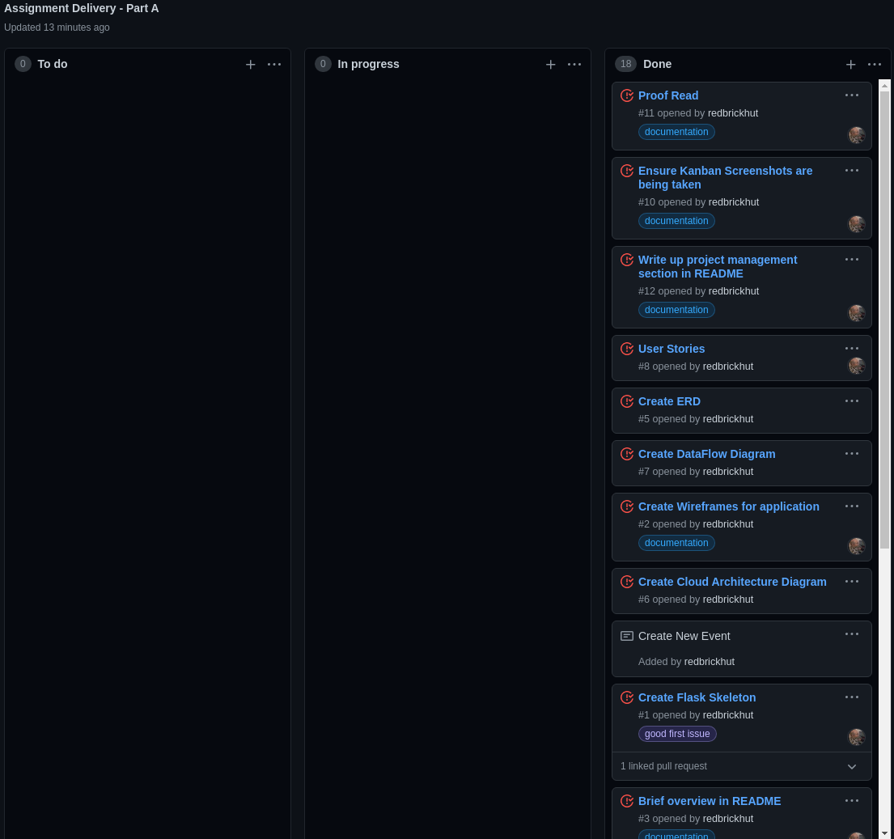

# Secret Santa

This application is a micro-game designed purely around creating the social interaction of Secret Santa, but in a virtualized, online environment. All users involved in an event can send an receive an emoji gift under the guise of random mystery. What fun!

## How it Works
1. Once a user is registered, they can create an event. Invites are sent by specifying an email.
2. If a user isn't registered, they'll be invited via the specified email to join up. Once registered they'll be automatically be added to the event. There's no opting out once you've joined Secret Santa, once you're in, you're in!
3. When the creator of an event is happy that everyone has joined, they can set a time for the big reveal. The gift givers and recipients are all determined and people can start giving.
4. Now the fun begins! Users will be notified that they have some gifting to do, and can choose their emoji and personalized message of choice.
5. When the big reveal occurs, users can log in and open their present, if their gift givers went MIA they'll receive coal instead :(
6. Grinches are pubically shamed, as they should be.

## Who is This Application For?

Anyone who's after a bit of fun! This game is probably best played amongst friends, but there's nothing that precludes strangers from playing as well. It's also designed to be a fun exercise for companies that want to create a bit of social engagement amongst their peers. 

## Tech Stack

* Python + Django: Serves as the application layer for the program. Handles everything from processing web endpoint requests, and acts as the ORM between the application and data layers.

* AWS Elastic Beanstalk: Provisions the web servers containing the Django application by automatically configuring an auto-scaling group of EC2 instances. 

* S3 / Cloudfront: Where static content and user uploaded images are stored. S3 physically stores the media, and Cloudfront provisions it through caching and duplicating in edge locations close to the user.

* Amazon Simple Email Service: Responsible for handling email communications to users. This is of particular importance for inviting new users to join, as well as notifying them when they've been added to an event, or when it's present opening time.

* Postgres / RDS: The underlying implementation of the data layer is a PostgreQL database, which is provisioned by an Amazon EC2 instance.

* Celery: This library is used to handle asynchronous background tasks. Celery ensures that long-running tasks (such as dispatching bulk emails) don't lock the request thread.

## User Stories

The following snippets provide an insight into what kind of user the application is for:

> As a mother with children interstate that can no longer attend the family Christmas, I want to be able to create a moment of connection in order to provide a sense of occasion that would not otherwise be possible.

> As a new manager taking on an established team, I want to host an activity in order to break the ice with my new employees.

> As a motivational speaker, I want to use the Secret Santa game as a mystery 'whodunnit' exercise with my clients, in order to stimulate discussions involving deductive reasoning. 

## Wireframes

### Login Screen

This screen will appear if the user has not authenticated and attempts to view any page in the domain. The two options are to log in or sign up.

### Create Account

This screen takes the user through the process of registering for Secret Santa. This is the page that a user will be directed towards if they've been invited by email as well.

### Edit Profile

If the user wishes to change their profile picture or display name, they can do so via this page.

### Landing Page

This is the page that gets loaded once the user is successfully logged in. It serves as the main index of the site.

### My Events

Any events that the user has created or been invited to will appear here.

### Create New Event

This is where a user can create a new event by specifying a name, description and time. They can also specify participants via email. If the email is already associated with an account, the user will be automatically added to the event, otherwise they will be invited via email to join. The creator can edit the event as many times as they like, however once the event has been set, no further changes will be possible.

### View Event

This is where all users can view events, and what they will see will vary on the current state of the event, designated by the status window section. The status windows could resemble any one of the following:

.png)

#### Event Phases

* Pre-Confirmed: If the user did not create the event, they will simply be informed to check back another time.

* Pre-Confirmed (Owner): If the owner views this section during this phase, they will have the option to edit or confirm the event, the latter of which will move the event onto the next phase.

* Gifting Phase: Users will be given a link to another page where they can choose their gift for their recipient.

* Post-Gifting Phase: Users will be given a countdown timer for when the event is due to begin.

* Reveal Phase: Users will be able to view an animation of the present being opened when they click on it.

* Post-Reveal Phase: The user can now see the gifts that others have received, and who turned out to be a grinch.

### Gifting Page

This window, linked from the event view page, allows the user to select an emoji and write a personalized message to their recipient. This is a one shot window, once the user has selected their present there's no taking it back!

## Data Model

In order to establish how the application should function, it is important first to establish a definition for the data that is passed through the system. Since a relational database will serve as the sole persistence layer of the application, an Entity Relationship Diagram is essential as the starting point for development. This is initial proposed scheme:

Care has been taken to ensure that data can be updated and read according to the user experience outlined in the wireframes above. 

Now that the data model has been established, the flow of data can be established. Firstly, the login loop is shown below. This check is performed on access to **any** page on the website:

When a user creates an event, here is the high-level overview of the processes that occur:

And finally, when the creator of an event decided to confirm an event, the following events happen:

## Cloud Architecture

For this application I'm relying on AWS infrastructure. I'm employing Elastic Beanstalk to automatically provision EC2 instances. It will scale between 1-4 instances that are T2.micro class machines. These machines will be running docker images. This should provide a reasonable amount of scaling without becoming exorbitantly expensive. The instances will also be distributed across two different availability zones to increase resiliency.

Since these EC2 instances will be located in private subnets, in order to access services outside the VPC, VPC Endpoints will be used. This will allow the application to update the S3 bucket which hold the static images hosted by the application, as well as trigger the Simple Email Service (SES) that notifies users of application events.

The data layer will be stored in a single T2.medium instance on one of the private subnets.

In order for static content to be served to the user, the application will create signed or unsigned URLs as appropriate when generating HTML templates. These URLs when automatically accessed through the browser will retrieve assets through AWS Cloudfront.

Route 53 will provide the alias to connect a custom hostname to the Elastic Beanstalk application.

The application therefore can be represented as follows:

## Project Management 

In order to deliver part A of the assignment in an effective and time sensitive manner, I've utilized the following tools:

* A kanban board in this repository's [project page](https://github.com/redbrickhut/secret_santa/projects).
* Breaking up tasks by creating [issues](https://github.com/redbrickhut/secret_santa/issues), with which I can keep a running thread of communication. I make extensive use of issue tagging as well.

Screenshots of the kanban board at various stages throughout the project:

